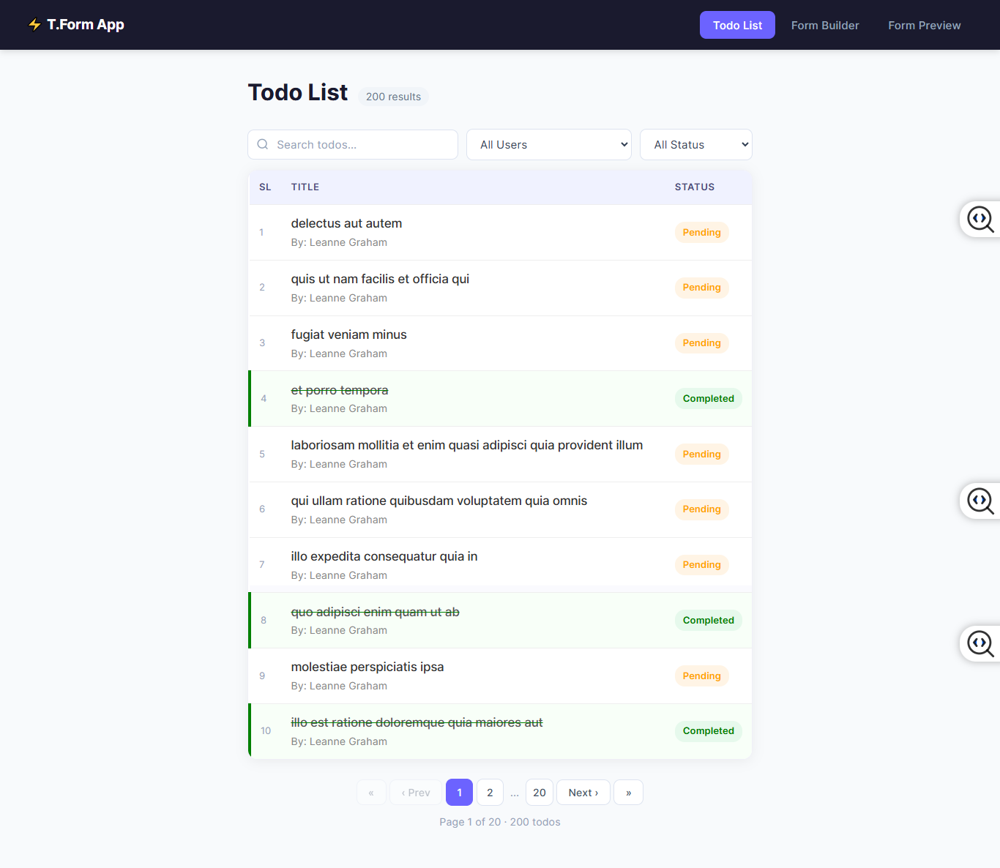
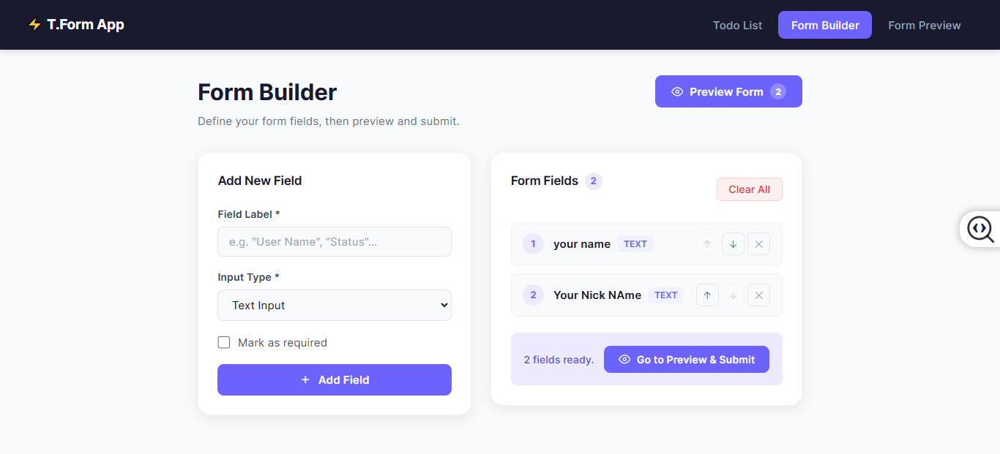
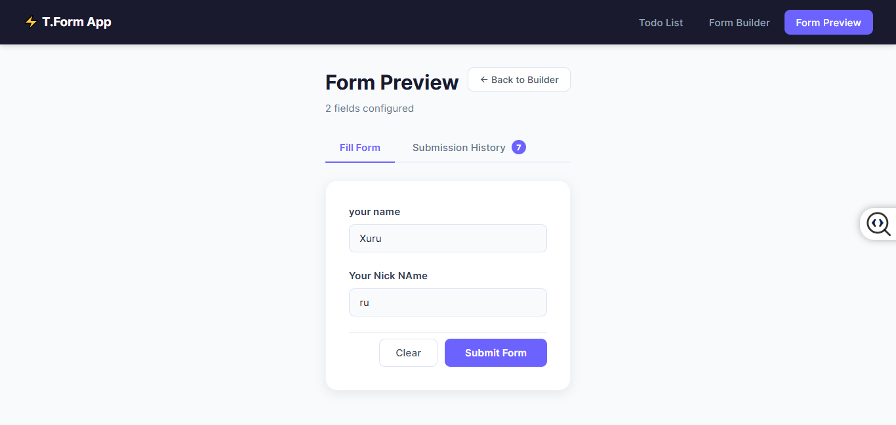
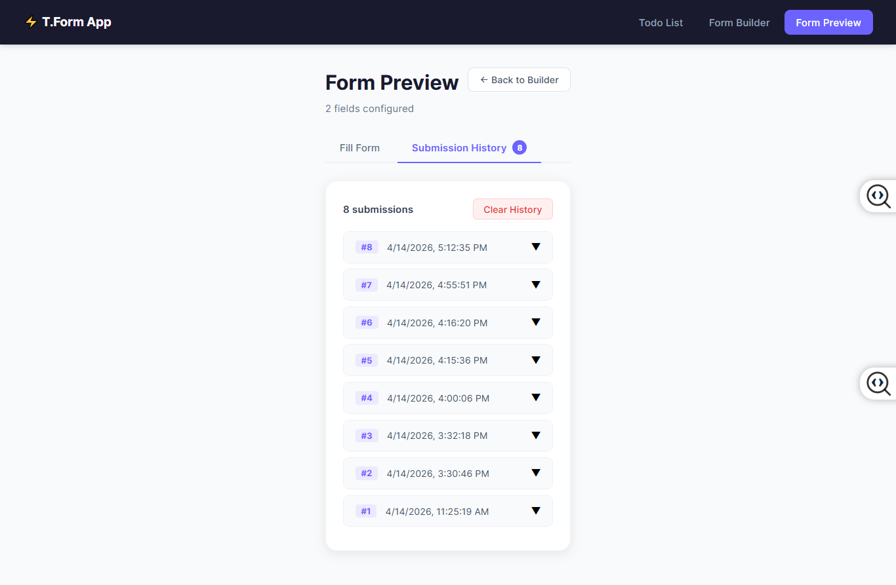

# T.Form App — Todo & Dynamic Form Builder

A professional React application built with TypeScript, featuring a robust Todo management system and a powerful Dynamic Form Builder with persistent history and advanced filtering.

---

##  Setup Instructions

### 1. Prerequisites
Ensure you have **Node.js** (version 18 or higher) installed on your machine.

### 2. Clone & Installation
```bash
# Clone the repository
git clone <https://github.com/Razu-Biswas/tform-app.git>

# Enter the project directory
cd react-app-ts

# Install dependencies
npm install

```
---

### Step 3 — Environment Configuration

```
Create a .env file in the root directory and add the following line to connect the API: 
```
```
VITE_API_BASE_URL= only api
Example: www.api.com
```
> **What are these packages?**
>
> - `react-router-dom` — handles page navigation between different URLs
> - `zustand` — a simple and lightweight state management library

---

---

### Step 4 —  Run 

```bash
npm run dev
```

Open  browser and visit:

```
http://localhost:5173
```

You will be automatically redirected to the Todo List page.

---

### Available Pages

| URL | Page |
|-----|------|
| `http://localhost:5173/todos` | Todo List |
| `http://localhost:5173/form-builder` | Form Builder |
| `http://localhost:5173/form-preview` | Form Preview and Submit |

---

---

## Technical Approach

---

### Feature 1 — Todo List

#### Data Fetching

When the Todo List page loads, the `useTodos` custom hook fetches data from
two API endpoints at the same time using `Promise.all`:


Running both requests simultaneously is faster than waiting for one to finish
before starting the other.

Since each todo only contains a `userId` number, we build a lookup map so we
can display the real user name next to each todo:


We wrap this in `useMemo` so it is only recalculated when the users array
actually changes, not on every single render.

#### Filtering and Search

All three filters are applied together inside a single `useMemo` call:

When the user types in the search box, the matched portion of the todo title
is highlighted using a `<mark>` element rendered inline.

#### Pagination

The filtered list is split into pages of 10 items each. Smart page numbers
are displayed with `…` for skipped ranges so the pagination bar stays compact
even when there are many pages.

#### State Persistence — How Filters Survive Navigation

```

```

This behaviour is achieved by using Zustand **without** the `persist` middleware.
The state only lives in memory — it survives navigation but resets on refresh.


---

### Feature 2 — Dynamic Form Builder

#### How the Form Builder Works

On the **Form Builder** page (`/form-builder`), the user builds a form by
adding fields one at a time. For each field they specify:

| Setting | Description |
|---------|-------------|
| **Label** | The display name shown on the form, e.g. "Full Name" |
| **Input Type** | One of 7 supported types (see table below) |
| **Options** | Required for `select` and `radio` — comma-separated choices |
| **Required** | Whether the field must be filled before the form can be submitted |

**Supported input types:**

| Type | Renders as |
|------|-----------|
| `text` | Single-line text input |
| `email` | Email input with basic format validation |
| `number` | Numeric input |
| `textarea` | Multi-line text area |
| `select` | Dropdown menu |
| `checkbox` | Single checkbox (yes / no) |
| `radio` | Group of radio buttons |

Fields can be reordered using the ↑ and ↓ buttons, removed individually,
or all cleared at once with the **Clear All** button.

#### How the Form Preview Works

The **Form Preview** page (`/form-preview`) renders the exact form the user
designed in the builder. Each field type produces the correct HTML input element.

When the user clicks **Submit Form**:

1. A `SubmittedEntry` object is created with a timestamp and all field values
2. It is saved to `useSubmissionStore` — which uses the `persist` middleware
3. Zustand automatically writes the data to `localStorage`
4. The data is printed to the browser developer console using `console.group` and `console.table`
5. A success screen appears with options to submit another response or view history

The **Submission History** tab shows every past submission as an expandable card.
This history survives browser refresh because it lives in `localStorage`.

#### State Architecture — Two Separate Stores

The form feature uses two Zustand stores with different persistence strategies:

```
useFieldStore
─────────────
Strategy   : in-memory only  (no persist middleware)
Stores     : the list of fields the user added in the builder
Navigation : fields survive page navigation  
Refresh    : fields reset to empty  

```
---

### Why These Tools Were Chosen

#### Zustand over Redux

Zustand requires far less boilerplate. There is no Provider component to wrap
around the app, no separate action creators to define, and no reducers to write.
You create a store, export it, and call it directly in any component.

#### CSS Modules over plain CSS

CSS Modules automatically generate unique class names at build time, so styles
from one component can never accidentally override styles in another. This keeps
the codebase maintainable as it grows.

#### Vite over Create React App

Vite starts the development server almost instantly and supports Hot Module
Replacement — meaning changes you save appear in the browser immediately
without a full page reload.

---

##  Feature Checklist

### Todo List
- [x] Fetch todos and users from the JSONPlaceholder API
- [x] Display todo title, completion status badge, and user name
- [x] Filter by user (dropdown)
- [x] Filter by status — All / Completed / Pending
- [x] Search by title with inline keyword highlighting
- [x] Active filter tags with individual remove buttons
- [x] Pagination — 10 items per page with smart page numbers
- [x] Filter, search, and current page are preserved on navigation
- [x] All state resets to default on browser refresh

### Form Builder
- [x] Add fields with label, input type, options, and required flag
- [x] Supports 7 input types — text, email, number, textarea, select, checkbox, radio
- [x] Reorder fields with up and down arrow buttons
- [x] Remove individual fields or clear all at once
- [x] Preview button navigates to the form preview page
- [x] Form preview renders the correct input for each field type
- [x] Submit saves the response to localStorage
- [x] Submit prints the response to the browser console
- [x] Submission history tab with expandable cards
- [x] Submission history persists across browser refresh
- [x] Clear history button with a confirmation prompt

---


#### 1. Todo List Page


#### 2. Form Builder Page


#### 3. Form Preview Page


#### 4. Form Submit Page


#### 5. Form Submit History Page



### Thank You . 